## 基于Java+Springboot的快递代拿系统063

## 一、系统介绍

本系统分为管理员、配送员、用户三种角色

1. **登陆与注册：** 用户名密码、短信验证码、人脸识别登录、QQ登录
2. **权限：** 普通用户、配送员、后台管理员
3. **普通用户**：下单支付、订单查询、意见反馈、订单评价
4. **配送员**：接单、订单管理、意见反馈、订单评价
5. **系统管理员**：用户管理、订单管理、反馈管理

## 二、所用技术

1. **前端：** Thymeleaf、Bootstrap、Ajax、JQuery
2. **开发环境：** IDEA 、SpringBoot 2.1、Maven
3. **数据库与缓存**：MySQL 5.7、Redis、Guava Cache
4. **三方服务**：腾讯云短信服务、支付宝支付（沙箱）、百度人脸识别
5. **安全框架**：Spring Security
6. **其他技术**：API 接口限速、二级缓存

## 三、环境介绍

基础环境 :IDEA/eclipse, JDK 1.8, Mysql5.7及以上,Maven3.6

所有项目以及源代码本人均调试运行无问题 可支持远程调试运行

## 四、项目运行截图

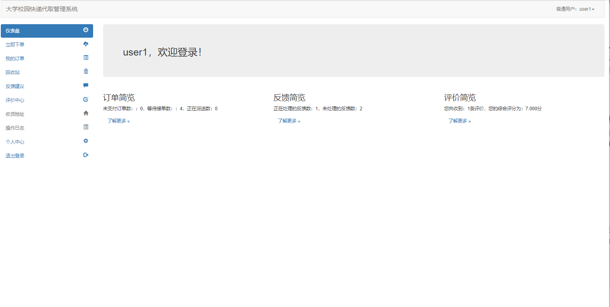

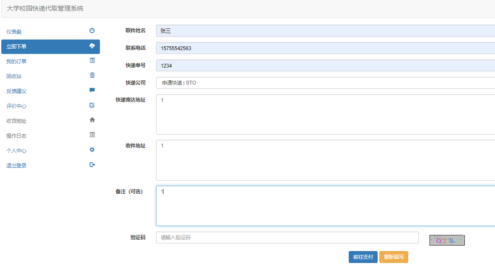

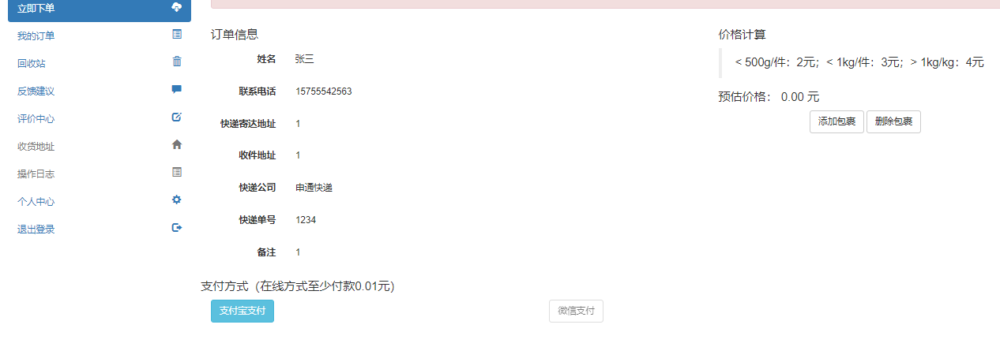

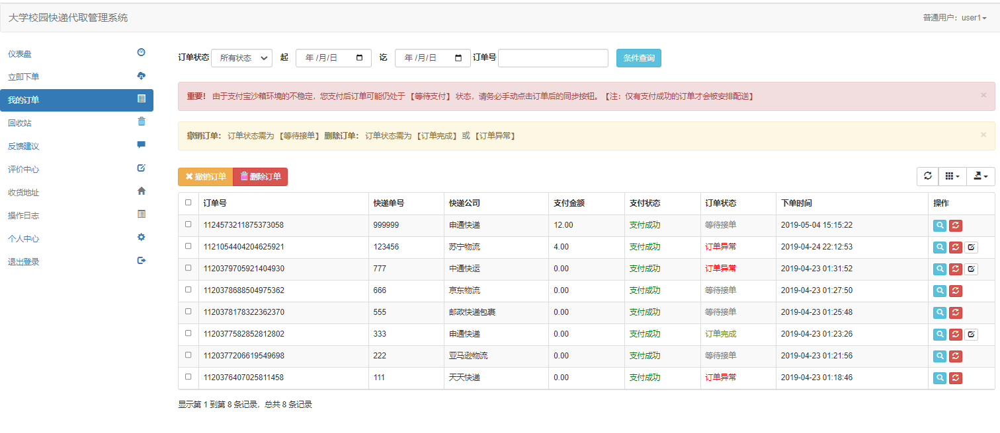

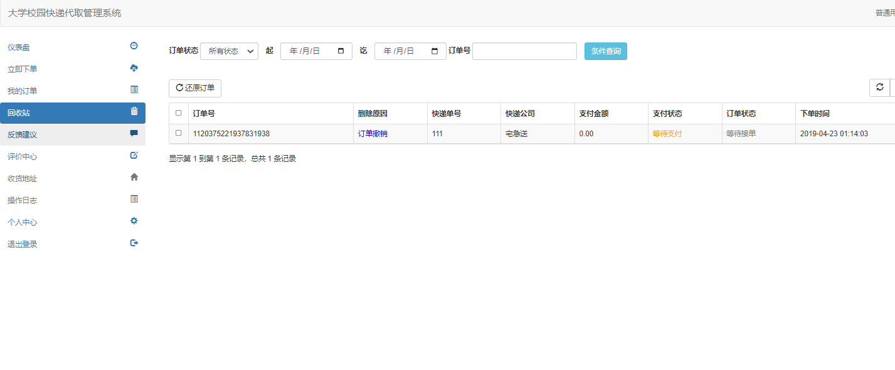

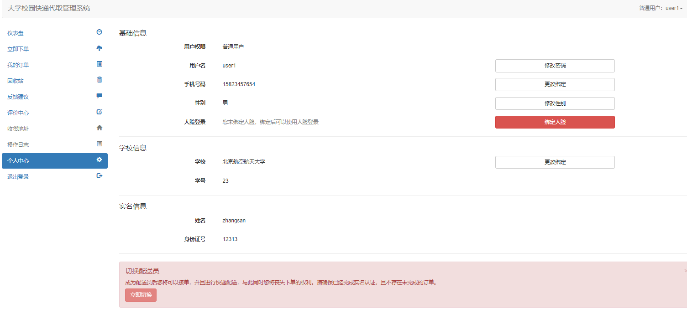

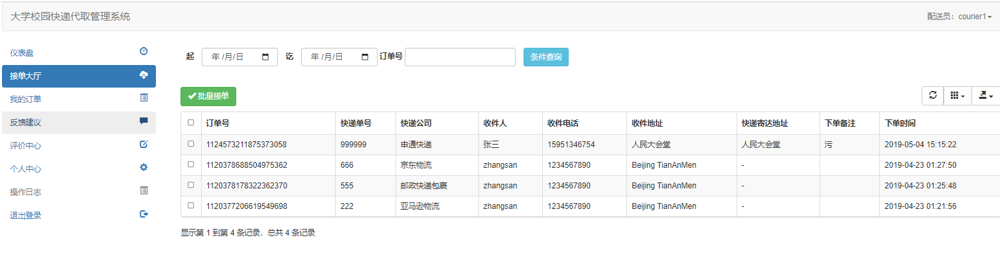

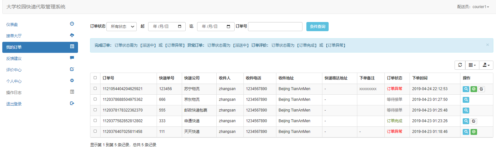

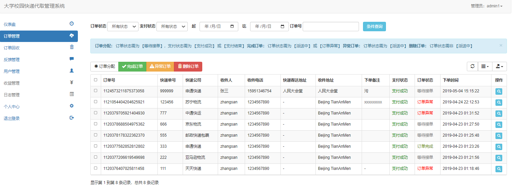

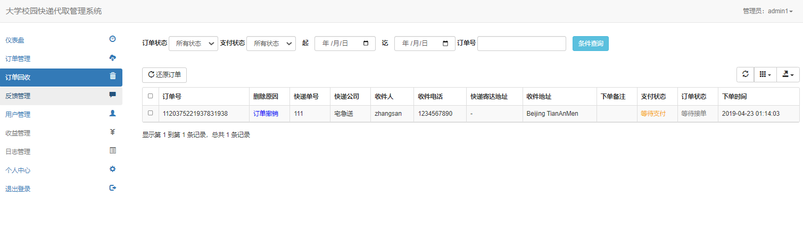

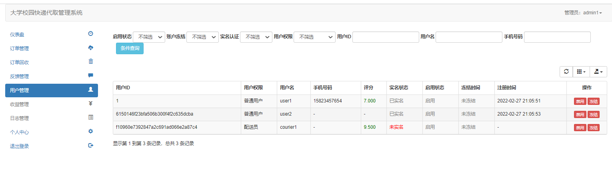

## 五、浏览地址

当您运行初始脚本后，默认存在以下用户，便于测试：
登录地址 ：http://localhost:8110/

|  登录名  | 密码 | 用户角色 |
| :------: | :--: | :------: |
|  user1   | 123  | 普通用户 |
|  user2   | 123  | 普通用户 |
| courier1 | 123  | 配送用户 |
|  admin1  | 123  |  管理员  |

## 六、部署教程

1. 使用Navicat或者其它工具，在mysql中创建对应名称的数据库，并执行项目的sql文件；
2. 使用IDEA/Eclipse导入项目，若为maven项目请选择maven，等待依赖下载完成；
3. 进入src/main/resources修改application-dev.yaml里面的数据库配置
4. 启动项目
